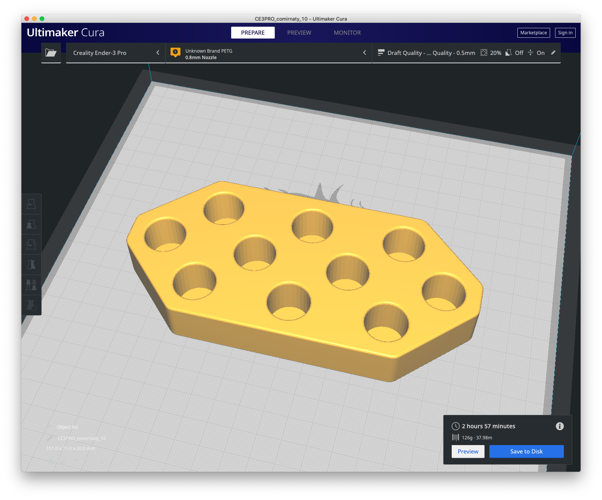
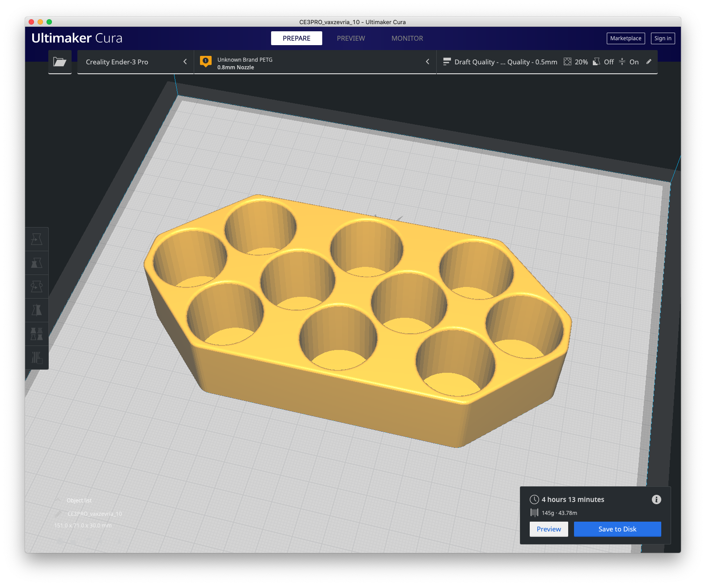

# Vaccine Vial Trays

In the Directory `<repo>/stl/` you will find several .stl for 3d self-printing
Trays for COVID-19 Vaccine Vials from the different Vendors.

## BioNTech Comirnaty

[Tray of 10 Vials vial\_tray\_comirnaty\_10.stl](stl/vial_tray_comirnaty_10.stl)

Print Settings: 

- max. 17mm Vial Diameter 
- 150mm x 70mm x 20 mm
- 0.8mm Nozzle
- 0.5mm Layer Height
- ~ 3h

## AstraZeneca Vaxzervia

[Tray of 10 Vials vial\_tray\_vaxzevria\_10.stl](stl/vial_tray_vaxzevria_10.stl)

Print Settings: 

- max. 26mm Vial Diameter
- 150mm x 70mm x 30 mm
- 0.8mm Nozzle
- 0.5mm Layer Height
- ~ 4h

### Disclaimer

This work is private and licensed by [CC BY-NC-SA 3.0](https://creativecommons.org/licenses/by-nc-sa/3.0/)

The models are not designed by the named vendors and therefore they are not official.

<b> Not for medical use certified! Not for resale oder Commercial Use.

